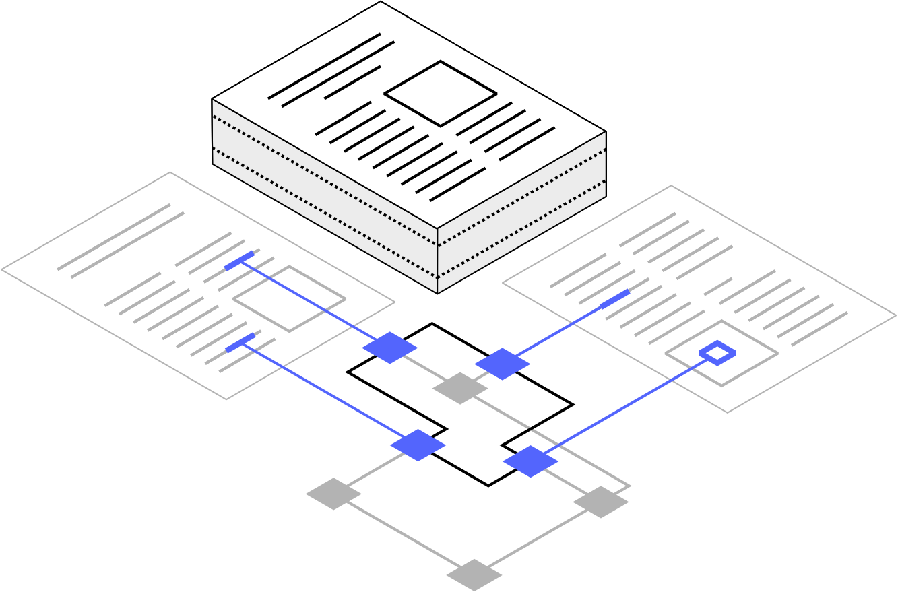

# Welcome to our OSS organization for document processing

The DS4SD organization is the home of the open-source projects of the AI for Knowledge group at IBM Research Europe - Zurich.

## Docling

**<a href="https://github.com/DS4SD/docling">Docling</a>** is our main open-source package. It is a powerful library which simplifies document processing, parsing diverse formats — including advanced PDF understanding — and providing seamless integrations with the gen AI ecosystem.

We support an amazing community which helps us driving forward the adoption of Docling.
Give it a try and join the community!

  

The key repositories of Docling are:

- [docling](https://github.com/DS4SD/docling) - The home of the main `docling` package.
- [docling-core](https://github.com/DS4SD/docling-core) -  The definition of types, transforms, serializers, etc. If it has to do with the `DoclingDocument` you will find it here.
- [docling-parse](https://github.com/DS4SD/docling-parse) - The backend PDF parser used by Docling.
- [docling-serve](https://github.com/DS4SD/docling-serve) - The FastAPI wrappers for running Docling as REST API and distribute large jobs.
- [docling-ibm-models](https://github.com/DS4SD/docling-ibm-models) - The AI models powering Docling.

## Deep Search

<a href="https://ds4sd.github.io/">Deep Search</a> leverages the output of Docling to Interprete, Index and Integrate the knowledge encoded in your documents. It offers a seamless chat interface for interacting with its RAG backend and navigate your data collections. 

Deep Search is a service and it provides a <a href="https://ds4sd.github.io/deepsearch-toolkit/">programmatic access</a>, for easy integration with other tools or in order to do bulk conversion. Our <a href=https://github.com/DS4SD/deepsearch-toolkit> python toolkit</a> provides these functionalities both as a client and library. Our [examples repository](https://github.com/DS4SD/deepsearch-examples) is very useful to get started.

## PatCID

[PatCID](https://github.com/DS4SD/PatCID) is a collection of chemical structures in patent documents to facilitate search of patent documents in the organic-chemistry domain. Programmatic access to PatCID can facilitate discovery of molecules. This collection was created by processing molecular-structure images in United States Patent and Trademark Office, Japan Patent Office, European Patent Office, Korean Intellectual Property Office, and China National Intellectual Property Administration patent documents.

The key repositories of the PatCID tools are:

- [PatCID](https://github.com/DS4SD/PatCID) - Examples and demostrators of PatCID.
- [MolGrapher](https://github.com/DS4SD/MolGrapher) - The graph-based visual recognition of chemical structures leveraged when building the PatCID database.
- [deepsearch-toolkit](https://github.com/DS4SD/deepsearch-toolkit) - The programmatic toolkit for interacting with the database and perform chemistry searches.

## Publications

[Find here our extensive list of publications!](https://ds4sd.github.io/#publications)

## IBM ❤️ Open Source AI

All our projects are brought to you by IBM.
